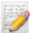

# Movie Age Rating Prediction 

This is a research with an objective to present an approach to work on Age rating from movies based on their subtitles. The methodology developed uses LIWC program, which contains a dictionary of words that allows  extracting linguistic, psychological and social characteristics of texts.
